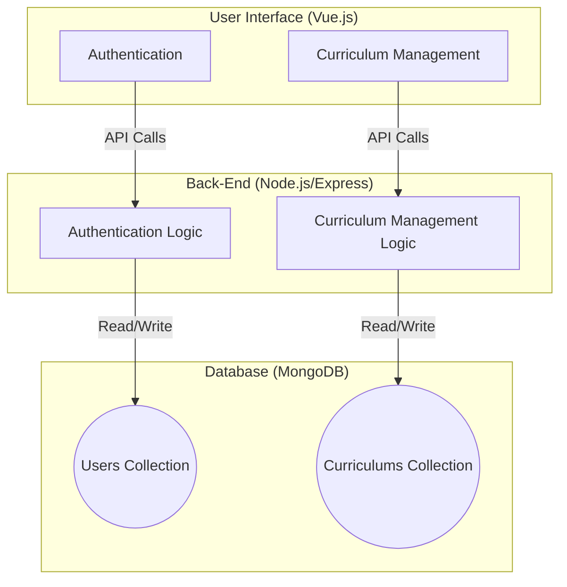
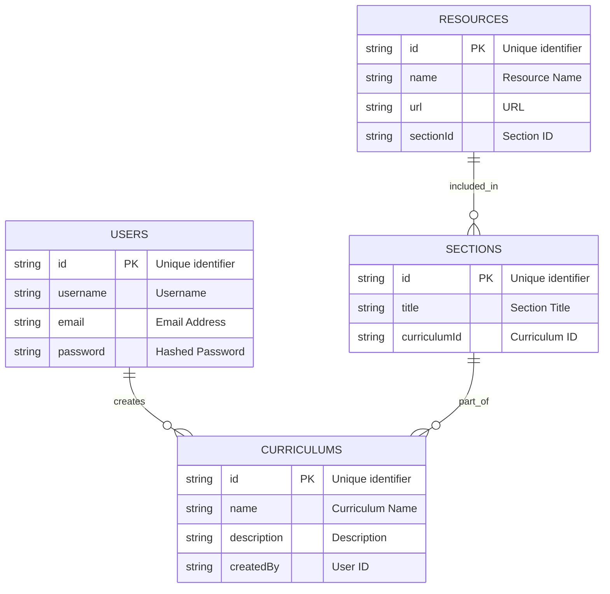
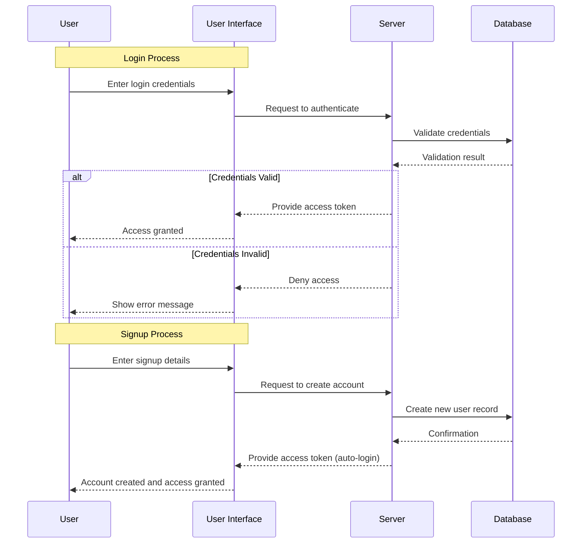

# New Project Template: Curriculum App MVP

## 1. Introduction

### 1.1 Purpose

This document outlines the architectural plan for the Minimum Viable Product (MVP) of the Curriculum App. It's intended for the project's development team, stakeholders, and future architects. It will guide the initial development and future enhancements.

### 1.2 Scope

The architecture covers the MVP of the Curriculum App, focusing on user account management, curriculum creation, viewing, updating, and deletion.

### 1.3 Definitions, Acronyms, and Abbreviations

- **MVP:** Minimum Viable Product
- **API:** Application Programming Interface
- **DB:** Database

### 1.4 References

- Vue.js Documentation
- Node.js Documentation
- MongoDB Documentation

### 1.5 Overview

The document proceeds to detail the architectural style, system stakeholders and concerns, a high-level system overview, architectural strategies, system architecture, key decisions, quality attributes, risks, and technical debt.

## 2. Architectural Representation

### 2.1 Architectural Style and Rationale

The system will use a **Monolithic Architectural Style** for the MVP to simplify deployment and development. Given the scope and scale at this stage, a monolithic approach is cost-effective and straightforward to implement.

## 3. System Stakeholders and Concerns

### 3.1 Stakeholders

- **Users:** Individuals creating and managing their learning curriculum.
- **Developers:** The team developing and maintaining the app.
- **Business Owners:** Stakeholders interested in the commercial success and growth of the app.

### 3.2 System Concerns

- **Performance:** Ensuring the app is responsive and efficient.
- **Scalability:** Ability to accommodate a growing number of users.
- **Security:** Protecting user data and privacy.

## 4. System Overview

### 4.1 High-Level Description

The Curriculum App allows users to create, manage, and share their learning curriculums. It includes user authentication, curriculum management, and community features for sharing and collaboration.

## 5. Architectural Strategies

### 5.1 Key Strategies

- Utilize **Vue.js** for a dynamic and responsive front-end.
- Implement **Node.js** with **Express.js** for a robust back-end.
- Use **MongoDB** for flexible and scalable database management.
- Ensure security with hashed passwords and authentication tokens.

## 6. System Architecture

### 6.1 Overview of Layers/Modules

- **Front-End Module:** Handles the user interface and client-side logic.
- **Back-End Module:** Manages server-side logic, API requests, and database interactions.
- **Database Module:** Stores and retrieves all application data.

### 6.2 Component Diagrams

### 6.3 Database Design

- **Users Collection:** Stores user information and hashed passwords.
- **Curriculums Collection:** Stores details of each curriculum, including sections and resources.

## 7. Key Architectural Decisions

### 7.1 Decision Log

- **Monolithic Architecture:** Chosen for its simplicity and ease of deployment for the MVP.
- **Tech Stack Selection:** Chosen based on team expertise and community support.

## 8. Quality Attributes

### 8.1 Performance

- Optimize response times with efficient API design and database indexing.

### 8.2 Scalability

- Prepare for future scaling by designing a modular and maintainable codebase.

### 8.3 Security

- Implement secure authentication, data validation, and encryption practices.

### 8.4 Maintainability

- Follow best coding practices and comprehensive documentation for easy maintenance.

## 9. Risks and Technical Debt

### 9.1 Identified Risks

- **User Adoption:** Risks related to market competition and user acquisition.
- **Technical Challenges:** Potential issues with integrating different technologies.

### 9.2 Technical Debt

- **Rapid Development:** Some best practices might be compromised for faster MVP rollout.

## 10. Appendices

### 10.1 Glossary

- *Define any additional terms used throughout the document.*

### 10.2 Index

- *Include an index of terms and sections for easy navigation.*

### 10.3 Revision History

- *Document the revision history of this document.*
